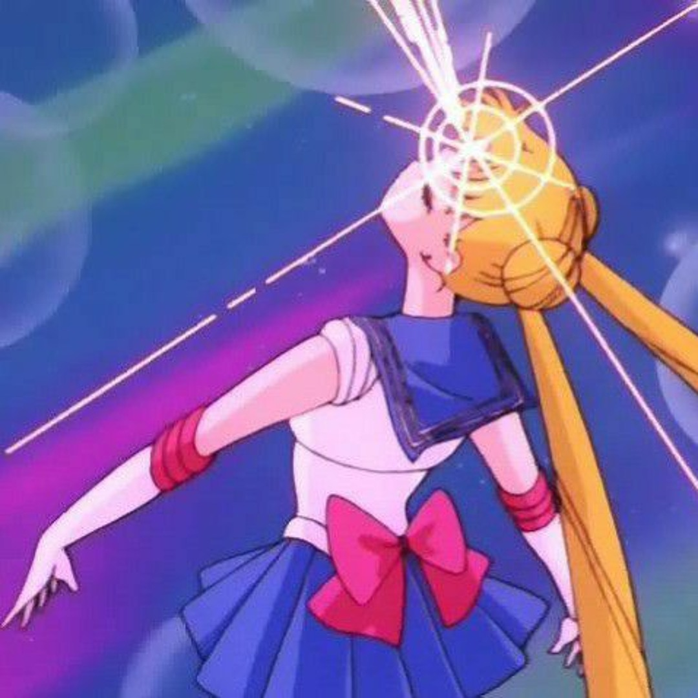
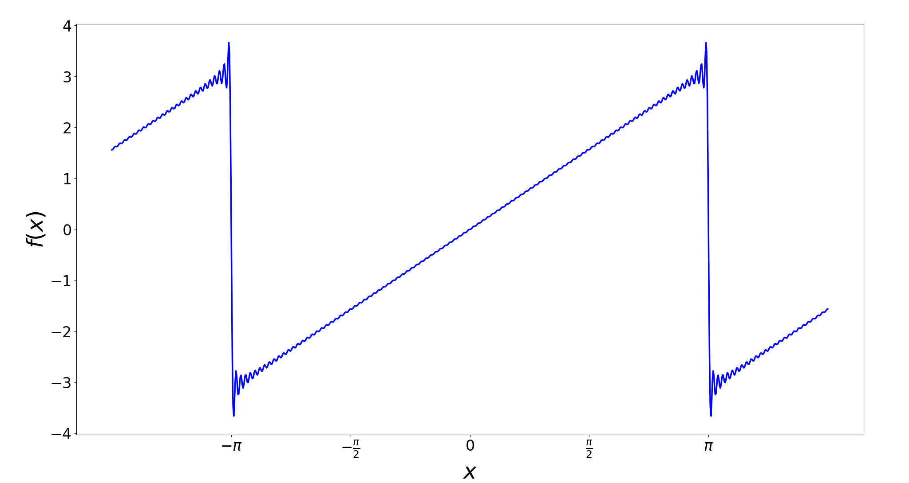

# On the Fourier transform
The fourier transform is this black box operation which takes in a function in terms of time and returns a function in terms of frequency. However treating the fourier transform as a pure black box is foolish, especially when what's inside isn't necessarily something that we need to be scared of.
<div style="text-align: center;">


</div>

## Linear Algebra and the Orthonormal Basis Vectors
I have seen a few "intuitive" explanations of the mathematics behind the fourier transform and although they do a good job of explaining the intuition behind the fourier transform at a high level, I still feel that they fail capture the *essence* of what the fourier transform really is doing at a low level. Which I feel is a shame because it is actually very cool, so let's talk about the mathematics foundational to fourier analysis. 

---

Suppose that we had some function $f:D\to\mathbb{C}$ mapping some domain $D$ to the complex numbers. The set of such functions $f$ forms a vector space. We can add and scale functions as we would expect:
$$(f + g)(x) \equiv f(x) + g(x) \quad \text{and} \quad (af)(x) \equiv af(x)$$
It is reasonable then to expect there to be a set of basis vectors, as in there is some minimal set of vectors $\{e_1, e_2, e_3, \dots \}$ for which any function can be written as a linear combination of our basis vectors.
$$f = a_1\cdot e_1 + a_2 \cdot e_2 + \dots$$ 
Where $a_1, a_2, \dots$ are complex number themselves. Much like how every point in $3$ dimensional space can be written as a linear combination of $(1,0,0)$, $(0,1,0)$ and $(0,0,1)$. 

### The Familiar $3$ Dimensional Vector Space

Notice the three vectors $(1,0,0)$, $(0,1,0)$ and $(0,0,1)$ are normal which means that their respective magnitudes are exactly $1$. 

Also notice that these three vectors are orthogonal, what this means in the context of $3$ dimensional space is that the angle between each of the respective vectors is exactly $90^\circ$ or in other words $\cos \theta = 0$ where $\theta$ is the angle between the two vectors. Which is also to say that two vectors $v_1$ and $v_2$ in $3$ dimensional spaces are orthogonal if and only if $|v_1|\cdot|v_2|\cdot\cos \theta = 0$. 

We may recognize this as the dot product between the vectors $v_1$ and $v_2$, so we can say that two vectors are normal if the "dot" product of the two vectors is $0$.

$$0 = \begin{bmatrix} 
   x_1 \\ x_2 \\ \vdots
\end{bmatrix}
\cdot
\begin{bmatrix}
  y_1 \\ y_2 \\ \vdots \\  
\end{bmatrix} = x_1 y_1 + x_2 y_2 + \dots
$$

Whats interesting about the dot product is that for any vector we can "extract" out one of the components of the vector by using the dot product.

If we had the vector $\begin{bmatrix}
   2 \\ 3 
\end{bmatrix}$ we could extract out the $\vec x$ component of the vector by dotting it with one of our orthonormal basis vectors $\begin{bmatrix}
    1 \\ 0
\end{bmatrix}$, we could also extract out the $\vec y$ component of this vector by dotting it with $\begin{bmatrix} 0 \\ 1 \end{bmatrix}$. Note that by extracting out the $\vec x$ and $\vec y$ components of $2$ and $3$, we have enough information to fully reconstruct the original vector. This is like a sommelier, who is able to pick out the individual components of a wine, you could imagine that this process if extended to arbitrary functions could be quite useful.

The fourier transform comes from extending the idea of the dot product to the vector space of functions and we will now refer to this dot product as the inner product.


### The Inner Product
An inner product is simply a function $\braket {\cdot, \cdot} : V \times V \to \mathbb{C}$, taking in two elements of a vector space and outputting a complex number.

The inner product is not just any function however, it is a function satisfying the following rules:
1. $\braket{\bold{0}, x} = 0$
1. $\braket {x,y} = \overline{\braket{y,x}}$
2. $\braket{ax+by, z} = a\braket{x, z} + b\braket{y, z}$ where $a$ and $b$ are scalers
3. $\braket{x,x} \ge 0$ with equality only when $x$ itself is $0$

If we have a set of orthonormal basis vectors $\{e_1, e_2, \dots\}$ then we have that $\braket{e_i, e_i} = 1$ and $\braket{e_i, e_j} = 0$ when $i \neq j$

Now finally if we have a function 
$$f = a_1 e_1 + a_2 e_2 + a_3 e_3 + \dots = \sum a_i e_i$$
We have that $\braket{f, e_j} = \sum{a_i\braket{e_i,e_j}} = a_j\braket{e_j, e_j} = a_j$

This is in essence what fourier analysis is about, we are able to split any function up into components that make it up as long as we find a suitable inner product and our set of components are orthonormal basis vectors.

### A Set of Orthonormal Basis Vectors
I claim that the set of functions $B = \{\dots,  e^{-ix} , e^0 , e^{ix}, \dots\}$ forms a set of orthonormal basis vectors over the vector-space of continuous functions with period $2\pi$ with the inner product

$$\braket{f,g} = \frac{1}{2\pi} \int_{-\pi}^{\pi} f(x) \overline{g(x)} dx$$

I would like to think that these are a very natural choice for a set of basis functions for the vector-space of continuous functions with period $2\pi$ as $e^{ix}$ is pretty much the most fundamental periodic function (you cannot have $\sin$, $\cos$ or any of the other trig functions without $e^{ix}$) 

We can prove that for any function $f : \mathbb{R} \to \mathbb{C}$ which is periodic with period $2\pi$ and for any large $n \in \mathbb{Z}^+$ that we pick there is a linear combination of functions in $B$ equal to $g$ for which $f(x) = g(x)$ for at least $n$ different values of $x$. This is not too hard to prove although a little tedious so is left as an exercise to the reader. (Hint: Linear Simultaneous Equation)

Note that is is also useful to think of these functions as mapping $(-\pi, \pi)$ to $\mathbb{C}$

We now show that the functions in $B$ are normal.
$$\braket{e^{inx}, e^{inx}} = \frac{1}{2\pi} \int_{-\pi}^{\pi} e^{inx} \cdot e^{-inx} dx = \frac{1}{2\pi} \int_{-\pi}^{\pi} 1 dx = \frac{2\pi}{2\pi} = 1$$

If you are observant then you might remember that the word orthonormal contains both ortho and normal. This means that we also have to show that our vectors are *ortho*gonal.
$$\braket{e^{inx}, e^{imx}} = \frac{1}{2\pi}\int_{-\pi}^{\pi} e^{i(n-m)x} dx = \frac{1}{2i\pi(n-m)}\left[e^{i(n-m)x}\right]_{-\pi}^{\pi}$$
Which is just going to be $0$.

So indeed our basis vectors are ortho and normal.

## The Basel Problem
We will now use fourier analysis to solve the following problem using the set of orthonormal basis vectors described above.
$$\frac{1}{1^2} + \frac{1}{2^2} + \frac{1}{3^2} \dots = \; ??$$
What we want is a function such that 
$$\braket{f,f} = \frac{1}{1^2} + \frac{1}{2^2} + \frac{1}{3^2} + \dots$$
Okay well lets take the function $f(x) = x$. I now claim that 
$$\braket{f, e^{inx}} = \frac{i(-1)^n}{n}$$ 
With the exception of $n = 0$ where the inner product evaluates to $0$. Again this is relatively easy to prove, but slightly tedious.

Then we know that when $f = \sum a_ie_i$
$$\braket{f,f} = \sum a_i\cdot\overline{a_i} = \sum |\braket{f, e^{inx}}|^2$$

This is actually really really good, using the inner product we are able to write the same expression in two different ways.

$$\frac{1}{2\pi} \int_{-\pi}^{\pi}x^2 dx = 2\sum \left|\frac{i(-1)^n}{n}\right|^2 = 2\sum \frac{1}{n^2}$$

This gives us that 
$$\sum_{n=1}^\infin \frac{1}{n^2} = \frac{1}{12\pi}\left[ x^3 \right]^{\pi}_{-\pi} = \frac{\pi^2}{6}$$

Yay! we have manage to achieve what Euler did 1735.

---
## Fourier Series

If you've managed to follow along then you might realise this means that
if $f(x) = x$ for $x \in [-\pi, \pi]$ then we can also write 
$$f(x) = \sum_{n \neq 0} \frac{i(-1)^n}{n} e^{inx}$$

Let's try and approximate the value of this infinite sum and plot the result.
```py
import numpy as np
import matplotlib.pyplot as plt

k = 100
def f(x):
    y = 0
    for n in range(-k, k+1):
        if n == 0:
            continue
        y += (1j * (-1)**n / n) * np.exp(1j*n*x)
    return y

X = np.linspace(-np.pi*1.1, np.pi*1.1, 1000)
Y = np.array([f(x) for x in X])

plt.figure(figsize=(10,10))
plt.plot(X,Y)

xticks = np.arange(-np.pi, np.pi + np.pi/2, np.pi/2)
xtick_labels = [
   r'$-\pi$', 
   r'$-\frac{\pi}{2}$',
   r'$0$', 
   r'$\frac{\pi}{2}$', 
   r'$\pi$'
]

plt.xticks(xticks, xtick_labels)

plt.xlabel("$x$")
plt.ylabel("$f(x)$")


plt.show() 
```
### Plot of $f(x)$ approximated with $200$ terms
 

We call the above infinite sum the fourier series of $f(x) = x$

## The Jump from Fourier Series to the Fourier Transform
We see that we can write any periodic function with period $2\pi$ as a linear combination of $\exp(inx)$ terms. This means that we can actually write any periodic with a period $T$ as a combination of $\exp(\frac{2i\pi nx}{T})$ terms. Can we use the same technique as we used before to extract these components out of a periodic function $f$ with period $T$? 

Let's consider the set of orthonormal basis vectors $\{ \exp(\frac{2i \pi n}{T}) \mid n \in \mathbb{Z} \}$, of course it's not really a set of orthonormal basis vectors unless they are normal and pairwise orthogonal and for that we need an inner product because how can you even claim the inner product between two vectors is $0$ without defining an inner product first.

Well I claim that the following choice of inner product is what we are looking for 
$$\braket{f, g} = \frac{1}{T}\int_{\frac{T}{2}}^{\frac{T}{2}} f(x)\overline{g(x)} dx$$
Again the details are not too bad but are the exact same as what we have previously done, so I'll skip over them.

Now the idea of the fourier transform is to take the limit of $T$ as $T$ approaches infinity. What this means is that our vector space approaches the set of functions which have an infinite period. Which just means any function. We can also think of this as expanding the function domain $(\frac{-T}2, \frac{T}2)$ to $(-\infin, \infin)$

Now our set of orthonormal basis vectors becomes $\{ \exp(\frac{n}{X}) \mid n \in \mathbb{Z} \}$ where $X$ is very large. This allows us to get $\frac{n}{X}$ to be arbitrarily close to any real number and so we can think of the basis vectors of this new vector-space to be the set of functions $e^{2\pi i \cdot tx}$ for any real number $t$. Which corresponds to the component of a function $f$ with frequency $t$.

Using $X$ to be a very large number
$$\braket{f, e^{2\pi itx}} = \frac{1}{X}\int^{\infty}_{-\infty} f(x) \cdot e^{2\pi i \cdot tx} dx$$ 
We can say that the "magnitude" of the component of function $f$ with frequency $t$ is proportional to
$$F(t) = \int^\infin_{-\infin} f(x) \cdot \exp(2\pi i \cdot tx) dx$$

This last part is very hand-wavy but it is a very natural extension of the mathematics used to create fourier series. It can also be seen that we turn the $\frac{1}{T}$ ito two $\frac{1}{\sqrt{T}}$'s which we shift into the basis functions.

But more or less we now see exactly why it is the case that the fourier transform can transform a function in terms of time into a function in terms of frequency. It is because the fourier transform is just the limit of an inner product which extracts out discrete frequency components from a function.

While you can intuitively think that the fourier transform has constructive interference when $t$ aligns with the "frequency" of $f$ and destructive interference otherwise I think that this is a very useful way to think about the fourier transform but also misses a very cool detail which I think is very sad.